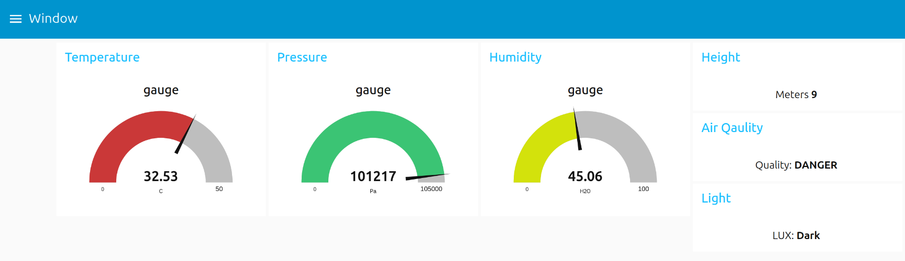
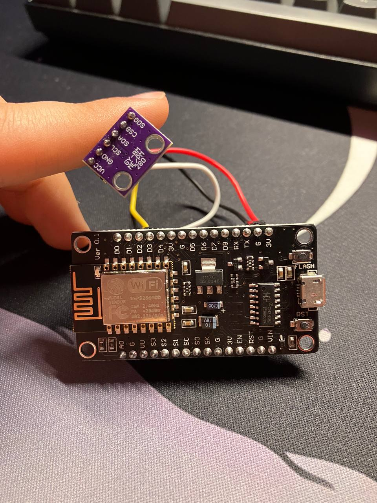
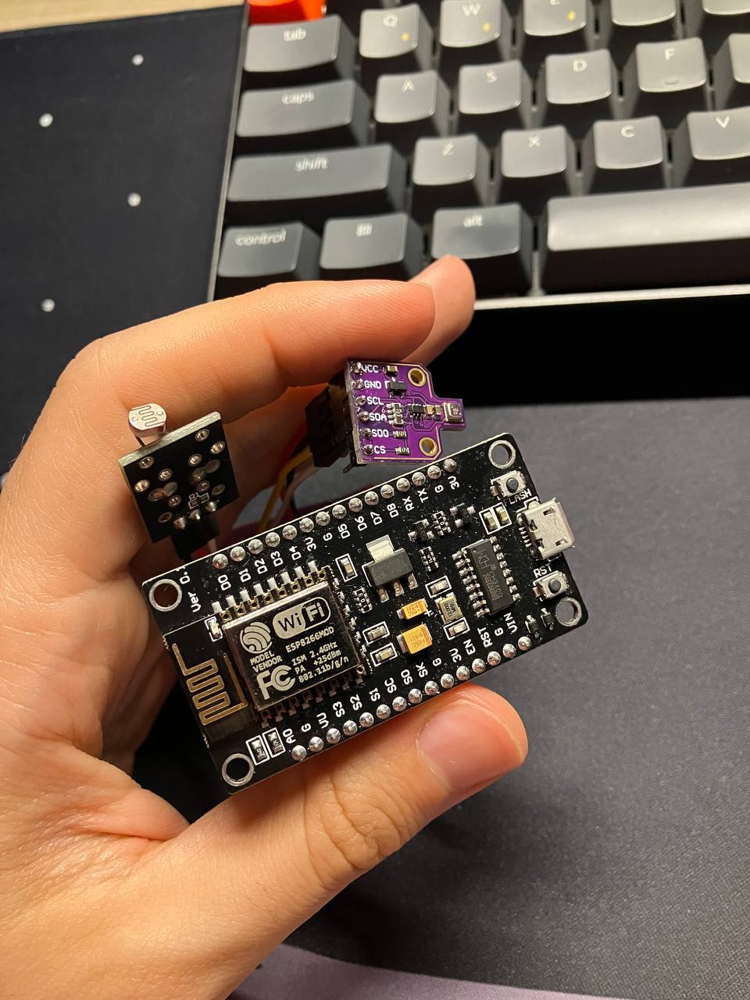
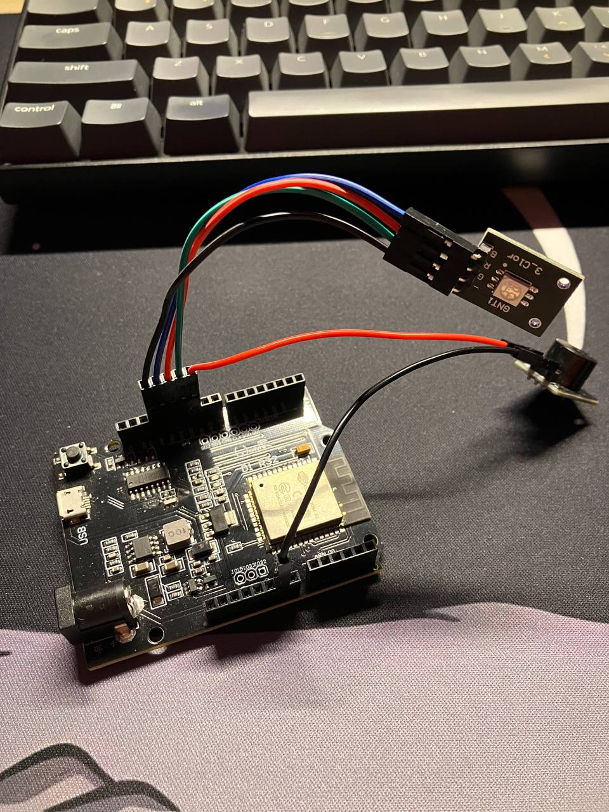

# FreshAirIot 🌿

> A distributed IoT system that tells you — through light, music, and Telegram messages — whether you should open your windows right now.

Air quality affects everything: your sleep, your focus, your health. But knowing *when* to open a window isn't obvious. Is the outside air actually better than the inside? Is it about to rain? Is it too hot or too humid to bother?

FreshAirIot answers all of that automatically, with a network of ESP boards deployed around the house, a custom air quality index algorithm, a Telegram bot, and — the fun part — a buzzer that plays video game themes depending on what the air is doing.

---

## How it works

Multiple ESP8266 and ESP32 boards are placed in different spots around the house (room, hall, window sill, outside). Each one collects environmental data and publishes it over **MQTT** to a shared broker. A central actuator board subscribes to all those readings, runs the decision logic, and gives feedback to the user in three ways simultaneously:

| Signal | Meaning |
|--------|---------|
| 🟢 Green LED + Zelda theme | Air is good — **open the window** |
| 🟡 Yellow LED + Pac-Man theme | Borderline — **consider opening it** |
| 🔴 Red LED + DOOM E1M1 | Air is unhealthy — **keep it closed** |
| 🔵 Blue flashing + alert melody | Rain is forecasted — **windows stay shut** |

At the same time, a **Telegram bot** sends proactive notifications when weather conditions change and is available 24/7 to answer questions about the current environment.

---

## System architecture

```
┌─────────────────────────────────────────────────────────────┐
│                        House                                │
│                                                             │
│  [ESP8266 - Room]          [ESP8266 - Window / Outside]     │
│   BMP280 sensor             BME680 sensor + light sensor    │
│   temp · pressure           temp · humidity · pressure      │
│                             gas resistance · light level    │
│                                                             │
│  [ESP8266 - Hall]          [ESP8266 - Weather Station]      │
│   BMP280 sensor             BMP280 sensor + Telegram bot    │
│   temp · pressure           OpenWeatherMap API integration  │
│                             2-day rain forecast             │
│                                                             │
│                  ↓ all boards publish over MQTT ↓           │
│                                                             │
│              [ EMQX MQTT Broker — broker.emqx.io ]          │
│                                                             │
│                  ↓ actuator board subscribes ↓              │
│                                                             │
│  [ESP32 - Actuator]                                         │
│   RGB LED strip + buzzer                                    │
│   Runs decision logic, plays melodies, publishes verdict    │
│                                                             │
│  [Python Logger]           [Node-RED Dashboard]             │
│   Subscribes to all        Visualizes all MQTT streams      │
│   topics, writes daily     in real-time                     │
│   log files                                                 │
└─────────────────────────────────────────────────────────────┘
```

---

## Air Quality Index

The window board runs a weighted IAQ algorithm on the BME680 readings:

```
IAQ score = 80% gas resistance + 25% humidity + 10% temperature
```

The score maps to the standard AQI scale: **Good → Moderate → Unhealthy for Sensitive Groups → Unhealthy → Very Unhealthy → Hazardous**.

The actuator board then combines this outdoor IAQ with indoor temperature (averaged from room and hall sensors) and the weather forecast to make the final open/close recommendation.

---

## Tech stack

| Layer | Technologies |
|-------|-------------|
| Hardware | ESP8266 · ESP32 · BME680 · BMP280 · photoresistor · RGB LED · passive buzzer |
| Firmware | Arduino (C++) · Adafruit sensor libraries · PubSubClient (MQTT) |
| Messaging | MQTT over TCP · EMQX public broker |
| Notifications | Telegram Bot API · UniversalTelegramBot library |
| Weather | OpenWeatherMap Forecast API |
| Orchestration | Node-RED |
| Logging | Python 3 · paho-mqtt |

---

## Boards and sensors

### ESP8266 — Window / Outside sensor
Mounted near or outside a window. Uses a **BME680** (temperature, humidity, barometric pressure, gas/VOC resistance) plus a **photoresistor** for light level. Publishes all readings every 30 minutes.

### ESP8266 — Room sensor
BMP280 inside the room. Temperature and pressure only — used to compute average indoor temperature together with the hall board.

### ESP8266 — Hall sensor / Weather station
BMP280 in the hallway. Also runs the **Telegram bot** and polls the **OpenWeatherMap API** every 30 minutes for a 48-hour rain forecast. Sends a Telegram notification automatically if rain is expected the next day.

### ESP32 — Actuator
The brain of the user-facing feedback. Subscribes to all MQTT topics, evaluates the combined indoor/outdoor picture, and drives:
- An **RGB LED** to the appropriate colour
- A **passive buzzer** playing one of four melodies (Zelda, Pac-Man, DOOM, or a danger alert)
- An MQTT publish of the verdict (`WINDOWS OPEN` / `MAYBE WINDOWS OPEN` / `WINDOWS CLOSED`) so other subscribers can act on it

---

## Node-RED dashboard

Node-RED is used to subscribe to all MQTT topics and visualise the data streams in real time, with one flow per board location.

| Flow | Monitors |
|------|---------|
| NodeRed_room | Room temperature and pressure |
| NodeRed_hall | Hall temperature and pressure |
| NodeRed_window | Outdoor BME680 + light level + IAQ |
| NodeRed_actuators | Actuator decisions and LED state |



---

## Telegram bot

The bot runs 24/7 on the hall ESP8266. It sends a proactive message whenever rain is detected in the forecast:

> *"Hey I just wanted to tell you that tomorrow is going to rain, so the air will be better! :3"*


---

## Photos

| Hall board (BMP280) | Window board (BME680) | Actuator board (ESP32) |
|---|---|---|
|  |  |  |

---

## Getting started

### Hardware you'll need

- 3× ESP8266 (e.g. NodeMCU or Wemos D1 Mini)
- 1× ESP32
- 1× BME680 sensor
- 2–3× BMP280 sensor
- 1× photoresistor + 10kΩ resistor
- 1× RGB LED (common cathode) + 3× 220Ω resistors
- 1× passive buzzer

All sensors are readily available on AliExpress at low cost.

### Firmware setup

Each board has its own `.ino` sketch under `src/`:

```
src/
├── bme680_window_room/   # Window / outside sensor (ESP8266 + BME680)
├── bmp280_hall/          # Hall sensor (ESP8266 + BMP280)
├── bmp280_room/          # Room sensor (ESP8266 + BMP280)
├── esp32_actuators/      # Actuator board (ESP32 + RGB LED + buzzer)
└── esp8266_weather/      # Hall + Telegram bot + weather (ESP8266 + BMP280)
```

For each sketch, create the following credential header files in the same folder (they are gitignored):

```cpp
// WifiPassword.h
const char* ssid     = "YOUR_SSID";
const char* password = "YOUR_WIFI_PASSWORD";

// mqttCredentials.h
const char* username      = "YOUR_MQTT_USERNAME";
const char* password_mqtt = "YOUR_MQTT_PASSWORD";

// telegrambotCredentials.h  (weather board only)
const char* BotToken = "YOUR_BOT_TOKEN";
const char* ChatID   = "YOUR_CHAT_ID";

// openweather_api_key.h  (weather board only)
String open_weather_api_key = "YOUR_API_KEY";
```

Then flash each board using the **Arduino IDE** with the board manager configured for ESP8266/ESP32.

### Required Arduino libraries

Install via the Arduino Library Manager:

- `Adafruit BME680 Library`
- `Adafruit BMP280 Library`
- `Adafruit Unified Sensor`
- `PubSubClient`
- `UniversalTelegramBot`
- `ESP8266 Weather Station` (for `OpenWeatherMapForecast`)

### Python logger

Logs all MQTT traffic to daily files (`dump_YYYY-MM-DD`):

```bash
pip install paho-mqtt
python logger/FreshAir_Log.py
```

---

## MQTT topic map

| Topic | Publisher | Payload |
|-------|-----------|---------|
| `home/room/temperature` | Room board | `float` °C |
| `home/room/pressure` | Room board | `float` Pa |
| `home/hall/temperature` | Hall board | `float` °C |
| `home/hall/pressure` | Hall board | `float` Pa |
| `home/room/window/temperature` | Window board | `float` °C |
| `home/room/window/humidity` | Window board | `float` % |
| `home/room/window/pressure` | Window board | `float` Pa |
| `home/room/window/airquality` | Window board | `Good` / `Moderate` / `Unhealthy` / … |
| `home/room/window/airquality_voltage` | Window board | `float` Ohms (raw gas resistance) |
| `home/room/window/light` | Window board | `Dark` / `Dim` / `Light` / `Bright` / `Very bright` |
| `weather/` | Weather board | Weather description string (e.g. `"light rain"`) |
| `home/actuators` | Actuator board | `WINDOWS OPEN` / `MAYBE WINDOWS OPEN` / `WINDOWS CLOSED` / `DANGER` |

---

## Full report

A detailed technical report (hardware schematics, sensor calibration, system design rationale) is available as a PDF in the repository root:
[IOT_Report_LorenzoStigliano_185534.pdf](IOT_Report_LorenzoStigliano_185534.pdf)

---

## License

MIT — see [LICENSE](LICENSE).
